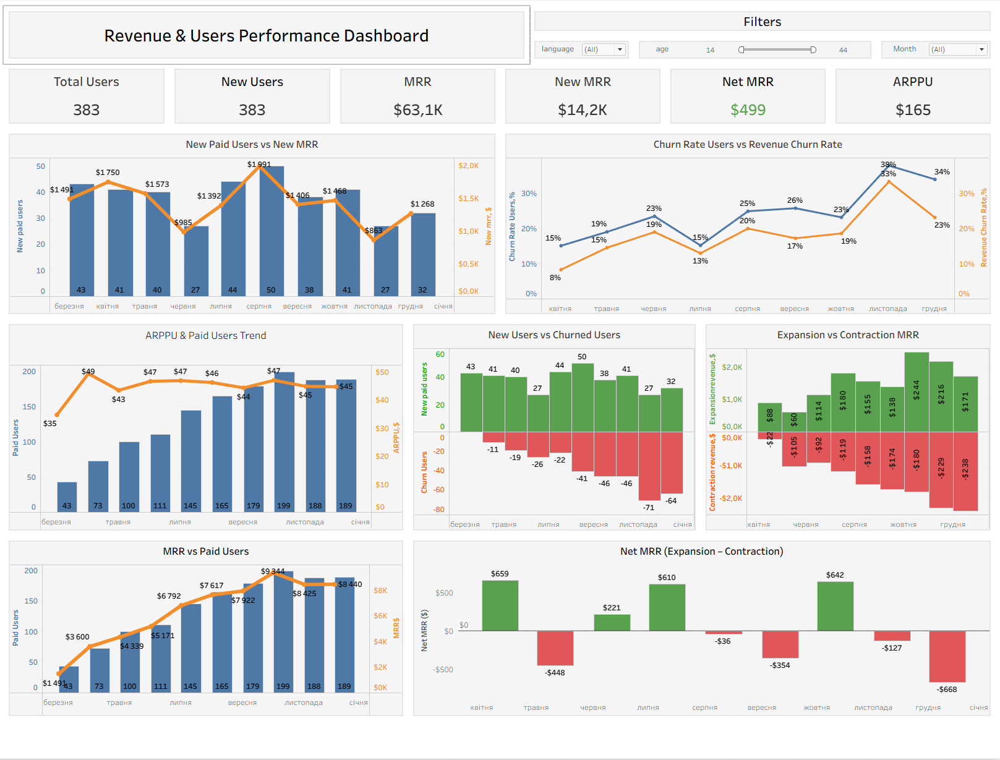

# 📊 Revenue & Users Performance Dashboard

## 🔍 Project Overview

This project analyzes revenue growth and user behavior in a subscription-based product.

The goal is to identify key drivers of MRR growth, detect churn patterns, and understand how user activity impacts revenue dynamics.

---

## 📌 Business Questions

* What drives MRR growth: new users or existing users?
* How does churn impact revenue over time?
* Are there periods of revenue contraction?
* What is the relationship between user growth and revenue?

---

## 🛠️ Tech Stack

* SQL (data extraction & transformation)
* Tableau Public (data visualization)
* Data Analysis

---

## 📈 Key Metrics

* **MRR (Monthly Recurring Revenue)** — total revenue per month
* **New MRR** — revenue from new users
* **Net MRR** — expansion minus contraction revenue
* **ARPPU** — average revenue per paying user
* **Churn Rate (Users & Revenue)** — user and revenue loss

---

## 🧠 SQL Logic

The analysis includes:

* Monthly revenue aggregation (MRR)
* Detection of new users using first payment logic
* Churn identification using LAG/LEAD window functions
* Revenue expansion and contraction calculation

---

## 📊 Dashboard Preview

---

## 🔗 SQL Query

You can find the full SQL query used for data preparation here:
👉 [View SQL query](analysis.sql)

---

## 📊 Tableau Dashboard

👉 [Open Dashboard](https://public.tableau.com/app/profile/djon.fa/viz/1_17776363782090/UserConversionFunnelAnalysis)

---

## 📌 Dashboard Features

* KPI overview (MRR, New MRR, Net MRR, ARPPU)
* Revenue trends over time
* Churn analysis (users and revenue)
* Expansion vs contraction analysis
* User growth analysis
* Interactive filters (age, language, month)

---

## 🔍 Key Insights

* Revenue shows overall growth but remains unstable
* Churn has a significant impact, especially in later periods
* Growth is primarily driven by new users rather than ARPPU increase
* Net MRR fluctuates due to revenue contraction periods

---

## 💡 Why It Matters

This analysis helps businesses:

* Identify churn as a key risk for revenue decline
* Understand whether growth comes from acquisition or retention
* Detect unstable revenue patterns
* Support data-driven product and marketing decisions

---

## 🚀 Conclusion

The dashboard provides a structured view of revenue dynamics and highlights churn as a critical factor affecting business growth.

---

## 👤 Author

Dmytro — Junior Data Analyst (SQL, Tableau)
